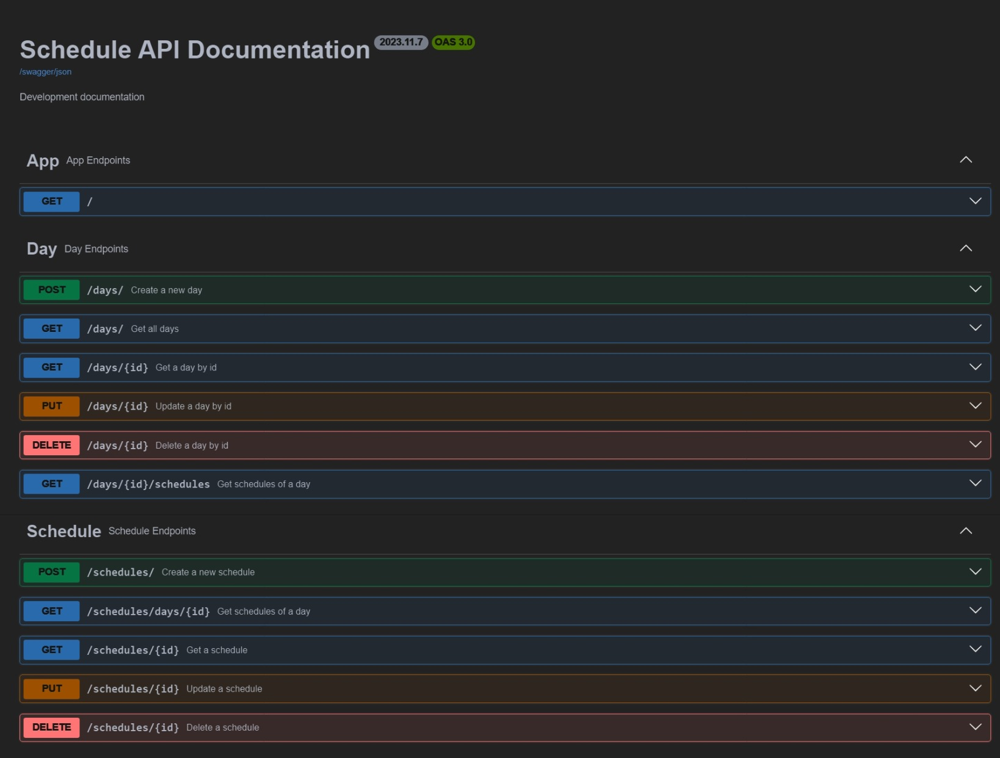

<div align="center">
    <h1>Schedule API</h1>
    <p>Basic Schedule API using ElysiaJs with Bun runtime.</p>
</div>

---

<p align="center">
  
</p>

## Features

- CRUD Days
- CRUD Schedule

Open `/swagger` to see the API documentation.

## Tech Stack & Library

- [Bun](https://bun.sh/) is Javascript Runtime.
- [ElysiaJs](https://elysiajs.com/) A TypeScript web framework powered by Bun.
- [Swagger Plugin](https://elysiajs.com/plugins/swagger.html) Plugin for generates a Swagger endpoint for an Elysia server.
- [Logysia](https://github.com/tristanisham/logysia) Classic logging elysia middleware.
- [Mongoose](https://mongoosejs.com/) Object Data Modeling (ODM) library for MongoDB and Node.js.

## ENV Variables
For env example, you can see [.env](.env.example).

## Development

To start the development server run:

```bash
bun dev
```

Open http://localhost:3000/ with your browser to see the result.
